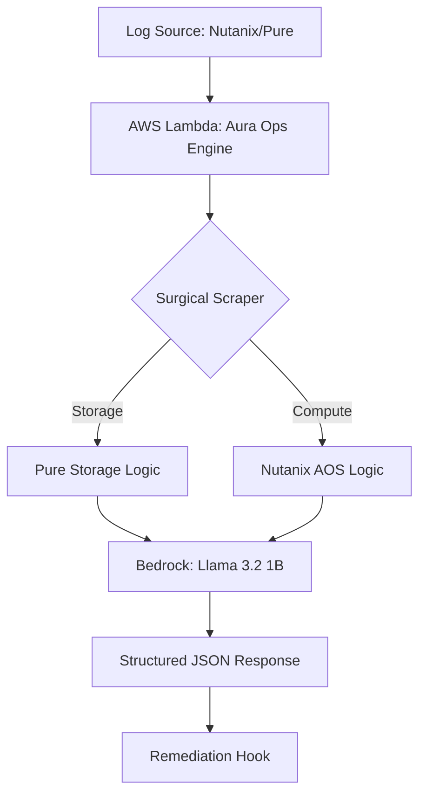

# Lambda-GenAI
### Sub-500ms Cold Starts for Llama 3.2 on AWS Lambda using Amazon Bedrock.

# ⚡ AWS Lambda + Llama 3.2 (Aura Ops v2.0)


[](https://console.aws.amazon.com/cloudformation/home?region=us-east-1#/stacks/create/review?stackName=AuraOps-Engine&templateURL=https://YOUR-S3-BUCKET.s3.amazonaws.com/aura-ops.yaml)

---

## 📘 The Aura Ops "Full Picture" Guide

### **The Why: Sovereignty & Simplicity**
In 2026, infrastructure logs are sensitive "fingerprints." Aura Ops allows you to deploy a **Private AI Diagnostic Engine** within your own AWS perimeter, ensuring data never leaves your control. We aim to bring "Prism-simplicity" to disaggregated Nutanix and Pure stacks without jumping between consoles.

### **The What: The Three Pillars**
* **The Scraper (Lambda)**: A lightweight Python filter identifying source (Nutanix vs. Pure).
* **The Brain (Llama 3.2)**: A private model performing Root Cause Analysis (RCA).
* **The Hook (Remediation)**: Pre-mapped CLI commands (ncli, purevol, kubectl) for instant resolution.

### **The How: One-Click Integration**
1. **Deploy**: Click the **Launch Stack** button above.
2. **Connect**: Copy the `AuraOpsEndpoint` from CloudFormation Outputs.
3. **Activate**: Paste into [Aura Ops Utility Settings](https://www.rack2cloud.com/aura-ops-utility/).

---

## 🛠️ Troubleshooting: Fix "AccessDeniedException"
If your Lambda fails immediately, your AWS account likely hasn't "unlocked" the AI model yet.

1. **Navigate**: Go to [Bedrock Model Access](https://console.aws.amazon.com/bedrock/home?region=us-east-1#/modelaccess) in `us-east-1`.
2. **Edit**: Click the orange **Edit** button (top right).
3. **Approve**: Check **Meta -> Llama 3.2 1B Instruct** and click **Save changes**.

---

## 🏗️ System Architecture

---

## 🛠️ Aura Ops Diagnostic Engine (Status: Stable)
We have successfully integrated the **"Surgical Scraper"** module using the **Amazon Bedrock Converse API**. This architecture utilizes **Inference Profiles** to ensure stability and zero-token-looping.

### **Diagnostic Support Matrix**
| System | Log Source | Status | Focus Area |
| :--- | :--- | :--- | :--- |
| **Nutanix AOS** | `syslog` / `logbay` | **Active** | Metadata (Cassandra), Data Path (Stargate) |
| **Pure Storage** | `purity//fa` alerts | **Active** | CBT Drift, Snapshot Consistency |
| **Kubernetes** | `kubectl describe` | **Active** | ImagePullBackOff, OOMKills |

---

## 🚀 CLI Integration
You can pipe cluster outputs directly into the engine for a sub-500ms RCA.

**Test the live endpoint:**
```bash
curl -X POST https://<YOUR-LAMBDA-URL>/ \
  -H "Content-Type: text/plain" \
  -d "Error: Purity//FA reported CBT drift on volume 'vol-01' during snapshot"
```
**Structured JSON Response:**
```json
 "rca": "The root cause is a corrupted volume file (vol-01) causing snapshot drift.",
  "severity": "Critical",
  "category": "Storage",
  "remediation_hook": "purevol snap create --suffix aura-ops-recovery vol-01",
  "source": "Aura-Ops-Engine-v2"
```

---

## 🗺 Roadmap (Aura Ops Integration)
- [x] Initial PoC with Llama 3.2 1B
- [x] Migration to Bedrock Converse API & Inference Profiles
- [x] Integration with Pure Storage Telemetry for CBT drift detection
- [x] Automated remediation hooks for Nutanix/Pure
- [x] Multi-region failover support for Bedrock Inference Profiles.

---
---

## 🚀 Technical Deployment Requirements

1. **Permissions**: Ensure your role has `bedrock:InvokeModel` access.
2. **Memory**: Recommended **512MB** for optimal inference speed.
3. **Environment**: Set `AURA_HOOK_URL` to `none` for initial testing.

---

## 📜 License

MIT - Created and maintained by the engineering team at [Rack2Cloud](https://www.rack2cloud.com).
