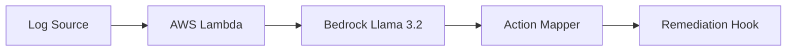

# Lambda-GenAI
Sub-500ms Cold Starts for Llama 3.2 on AWS Lambda using Amazon Bedrock.

# ⚡ AWS Lambda + Llama 3.2 (The Sub-500ms Cold Start PoC)

[](https://www.rack2cloud.com/aura-ops-utility/)
[](https://www.rack2cloud.com)
[](#)

This repository provides a high-performance implementation for running Generative AI (Llama 3.2) on AWS Lambda. By offloading weight-paging to the Amazon Bedrock managed plane, we achieve near-instant initialization, bypassing the traditional 10s+ "Cold Start" penalty.

---

## 🏗 System Architecture
The "Surgical Scraper" uses a keyword-interceptor logic to route logs to specialized AI personalities.


## 🛠 Aura Ops Diagnostic Engine (Status: Stable)
We have successfully integrated the **"Surgical Scraper"** module using the **Amazon Bedrock Converse API**. This architecture uses **Inference Profiles** to ensure stability and zero-token-looping.

### **Diagnostic Support Matrix**
| System | Log Source | Status | Focus Area |
| :--- | :--- | :--- | :--- |
| **Nutanix AOS** | `syslog` / `logbay` | **Active** | Metadata (Cassandra), Data Path (Stargate) |
| **Pure Storage** | `purity//fa` alerts | **Active** | CBT Drift, Snapshot Consistency |
| **Kubernetes** | `kubectl describe` | **Active** | ImagePullBackOff, OOMKills |

---

## 🚀 CLI Integration
You can pipe cluster outputs directly into the engine for a sub-500ms RCA.

**Test the live endpoint:**
```bash
curl -X POST https://<YOUR-LAMBDA-URL>/ \
  -H "Content-Type: text/plain" \
  -d "Error: Purity//FA reported CBT drift on volume 'vol-01' during snapshot"

{
```
**Structured JSON Response:**
```bash
 "rca": "The root cause is a corrupted volume file (vol-01) causing snapshot drift.",
  "severity": "Critical",
  "category": "Storage",
  "remediation_hook": "purevol snap create --suffix aura-ops-recovery vol-01",
  "source": "Aura-Ops-Engine-v2"
}
```

---

## 🗺 Roadmap (Aura Ops Integration)
- [x] Initial PoC with Llama 3.2 1B
- [x] Migration to Bedrock Converse API & Inference Profiles
- [x] Integration with Pure Storage Telemetry for CBT drift detection
- [x] Automated remediation hooks for Nutanix/Pure

---

## 🏗 Why this exists
In 2026, the shift toward **Sovereign Infrastructure** means we have to care about the substrate again. Managing disaggregated Nutanix + Pure stacks shouldn't mean jumping between different consoles. This project is the open-source core of our mission to bring simplicity to the hybrid-cloud stack.

## 🚀 Deployment
1. **Permissions:** Attach an IAM policy with `bedrock:Converse` to your Lambda role.
2. **Inference Profile:** Uses `us.meta.llama3-2-1b-instruct-v1:0` for stability.
3. **Settings:** Recommended memory: **512MB**.
4. **Environment:** Set `AURA_HOOK_URL` for automated webhook dispatch.

## 📜 License
MIT - Created and maintained by the engineering team at [Rack2Cloud](https://www.rack2cloud.com).
